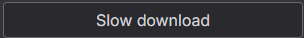
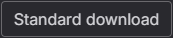

# Wabbajack Auto Download

A small AutoHotkey script that automatically detects Wabbajack/Nexus Mods download buttons and clicks them, allowing you to automate the **free download process without a Nexus Mods Premium account**.

> ⚠️ **Use with caution:** Automating interactions with Nexus Mods may be against their Terms and Conditions or other usage policies. Use it at your own discretion.

## Requirements

* Windows
* **AutoHotkey v1.1**
* Wabbajack
* A Nexus Mods account

> **Important:** This script is written for **AutoHotkey v1.1**. Do not use AutoHotkey v2 unless the script is converted first.

## Getting the script

Create the folder:

```text
D:\WabbajackAuto\
```

Copy the script below into a file named:

```text
WabbajackAuto.ahk
```

Save it inside the folder above.

### Script

```ahk
#NoEnv
#Persistent
#SingleInstance Force

CoordMode, Pixel, Screen
CoordMode, Mouse, Screen

SlowDownloadImage := "D:\WabbajackAuto\download-button.png"
StandardDownloadImage := "D:\WabbajackAuto\standard-download.png"

HomeX := 50
HomeY := A_ScreenHeight - 50

Loop
{
    ImageSearch, FoundX, FoundY, 0, 0, A_ScreenWidth, A_ScreenHeight, *10 %StandardDownloadImage%

    if (ErrorLevel = 0)
    {
        ClickX := FoundX + 85
        ClickY := FoundY + 18

        MouseMove, ClickX, ClickY, 5
        Sleep, 100
        Click

        Sleep, 1000

        GoHome()
        continue
    }

    ImageSearch, FoundX, FoundY, 0, 0, A_ScreenWidth, A_ScreenHeight, *10 %SlowDownloadImage%

    if (ErrorLevel = 0)
    {
        ClickX := FoundX + 149
        ClickY := FoundY + 18

        MouseMove, ClickX, ClickY, 5
        Sleep, 100
        Click

        Sleep, 500

        GoHome()
    }
    else
    {
        Sleep, 300
    }
}

return


GoHome()
{
    global HomeX, HomeY
    MouseMove, HomeX, HomeY, 10
}


F8::ExitApp
```

Your folder should contain:

```text
D:\WabbajackAuto\
├── WabbajackAuto.ahk
├── download-button.png
└── standard-download.png
```

## 1. Install AutoHotkey

Install **AutoHotkey v1.1**.

## 2. Create the button screenshots

The script uses `ImageSearch` to find the download buttons on your screen.

You need screenshots of:

* **Slow Download** button
* **Standard Download** button, shown only when downloading a mod larger than 500 MB

Take the screenshots from the **exact monitor you will use to run the script**.

Save them as:

```text
download-button.png
standard-download.png
```

### Important

The screenshots need to match your setup because `ImageSearch` looks for the button based on its appearance on your screen.

Things such as:

* Monitor resolution
* Windows display scaling
* Browser zoom
* UI scaling
* Different monitors
* Changes to the Nexus Mods website

can affect whether the script detects the button.

If you change your resolution, display scaling, or browser zoom, you may need to take the screenshots again.

You can use the images included in this repository as a reference.

**Slow Download**



**Standard Download**



## 3. Check the file paths

The script expects the images to be here:

```text
D:\WabbajackAuto\download-button.png
D:\WabbajackAuto\standard-download.png
```

If you use a different folder, update these paths in the script.

## 4. Start the script

Double-click:

```text
WabbajackAuto.ahk
```

The script will run in the background and continuously check your screen for the download buttons.

When it detects one, it will move the mouse to the button and click it.

## 5. Let it run

Leave the script running while Wabbajack downloads your mods.

> **Always test the script first before leaving it running unattended.**

## 6. Stop the script

You can stop the script in either of these ways:

* Right-click the AutoHotkey icon in the Windows system tray and select **Exit**
* Press **F8**

## Troubleshooting

### The script does nothing

The screenshot probably does not match the button on your screen.

Try taking a new screenshot from your own monitor.

Also check:

* Display scaling
* Browser zoom
* Monitor resolution
* Screenshot quality
* File names
* File locations
* Image paths in the script

### It worked before but stopped working

Nexus Mods may have changed the appearance of the download buttons.

Take new screenshots and replace:

```text
download-button.png
standard-download.png
```

### It clicks the wrong place

The script clicks a fixed position relative to the detected image.

If your screenshot is cropped differently, the click position may be wrong.

The click positions are:

```ahk
ClickX := FoundX + 149
ClickY := FoundY + 18
```

and:

```ahk
ClickX := FoundX + 85
ClickY := FoundY + 18
```

## Notes

* This is a simple image-based automation script.
* It does not interact directly with Wabbajack or Nexus Mods APIs.
* It detects the download buttons on your screen and clicks them.
* Results may vary depending on your display and browser configuration.
* Always test it before leaving it unattended.
* The complete source code is provided above so you can inspect it before running the script.
